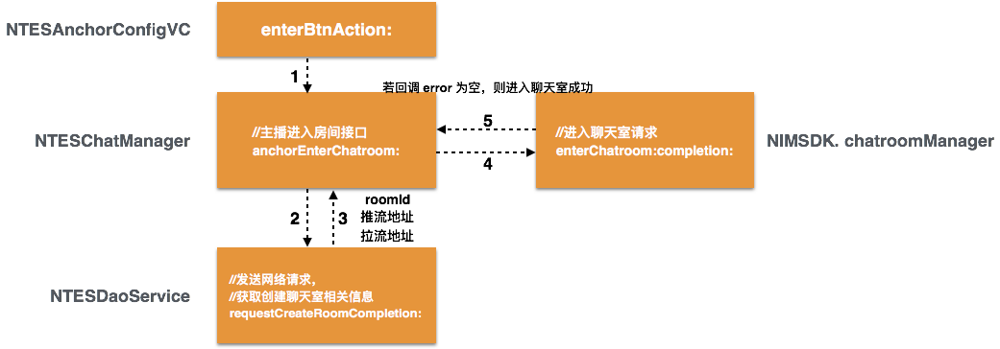
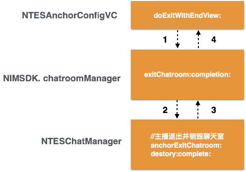
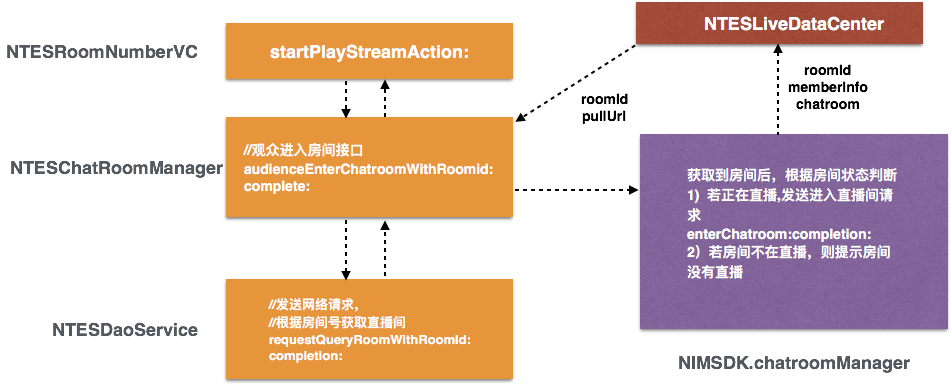
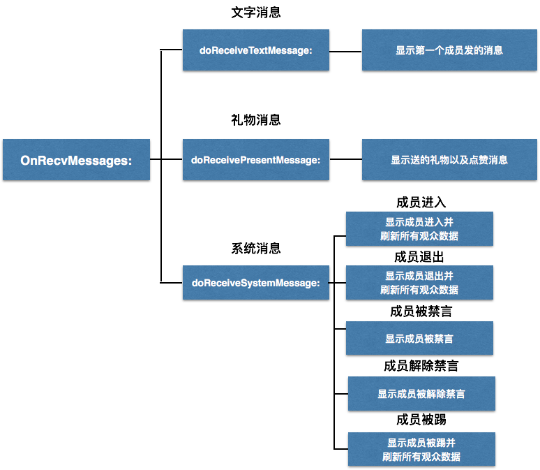
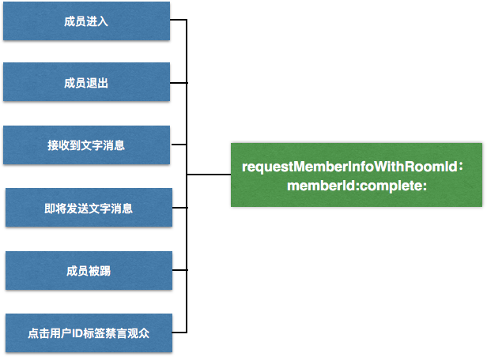
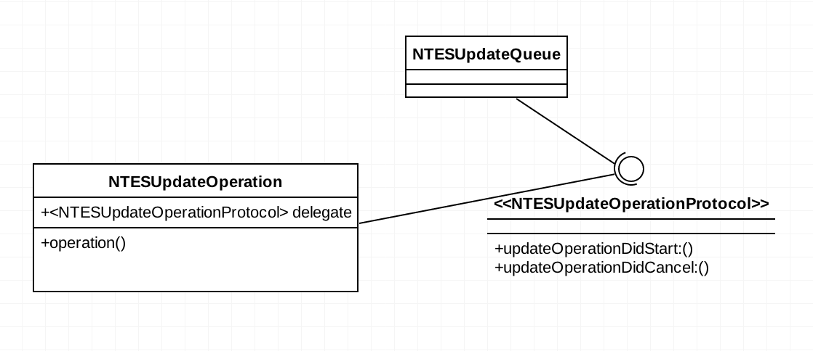

# iOS短视频融合demo导读 #

## 综述 ##
短视频融合解决方案是一个集成了录制转码 SDK、直播 SDK、即时通信 SDK、播放器 SDK、上传 SDK 的 iOS 客户端应用。应用主要包含直播、点播、短视频三个功能模块。

### 目录 ###
<a href="#auchor_live"> 1. 直播互动模块 </a></br>
&nbsp;&nbsp;<a href="#auchor_anchorEnter"> 1.1 主播创建直播间 </a></br>
&nbsp;&nbsp;<a href="#auchor_anchorLeave"> 1.2 主播离开直播间 </a></br>
&nbsp;&nbsp;<a href="#auchor_audEnter"> 1.3 观众进入直播间 </a></br>
&nbsp;&nbsp;<a href="#auchor_inter"> 1.4 主播与观众的消息互动 </a></br>
&nbsp;&nbsp;<a href="#auchor_protocol"> 1.5 主播与观众的消息协议 </a></br>
&nbsp;&nbsp;<a href="#auchor_refresh"> 1.6 观众信息的刷新 </a></br>
<a href="#auchor_demand"> 2. 点播录制模块 </a></br>
&nbsp;&nbsp;<a href="#auchor_upload"> 2.1 上传视频模块 </a></br>
&nbsp;&nbsp;<a href="#auchor_player"> 2.2 播放器模块 </a></br>
&nbsp;&nbsp;<a href="#auchor_record"> 2.3 视频录制模块 </a></br>

### 整体架构说明 ###
代码主体目录结构如下： 

```
--Base				//通用的页面配置模块
--Section		 	//主体业务功能模块
--View				//自定义UI组件模块
--Dao				//请求网络数据模块
--Helper			//工具类模块
--Categorys			//标准组件扩展模块
```

其中`Section`模块包括了直播、点播、短视频三个功能模块。每个模块基于 MVC 架构模式进行职能划分； **Model** 层定义每个实体的具体属性， **View** 层定义视图绘制样式， **Controller** 层主要扮演 Model 层和 View 层的中介者角色。

同时，模块的网络请求都与相应的 view controller 解耦，只向 View Controller 层提供接口，网络层具体又分为 Dao 层和 Service 层，前者主要用于网络数据的发送和接收，后者主要用于数据的封装以及向 View Controller 提供数据接口。


### <p id="auchor_live">1. 直播互动模块</p> 
#### <p id="auchor_anchorEnter"> 1.1 主播创建直播间流程: </p> ####
 在 **Section--Home--NTESLiveHomeVC** 目录文件下进行**身份**的选择。

若选择**主播身份**进行**推流**，首先进入 **NTESAnchorConfigVC** 进行推流端基本参数配置，包括是否传输音频、视频、以及清晰度选择。配置完成后点击“确定”按钮如下：  

```
// “确定”按钮点击事件
- (void)enterBtnAction:(UIButton *)btn
{
	...
	// 获取主播房间号，若成功获取，则进入直播准备页面（NTESLiveStreamVC）
	[[NTESChatroomManger shareInstance] anchorEnterChatroom:^(NSError *error, NSString *roomId) {
		...
	}];
	...
}
```  
 
 
 
成功创建房间进入聊天室之后，进入 **NTESLiveStreamVC** 页面。点击“开始直播”按钮，开始直播推流。

#### <p id="auchor_anchorLeave"> 1.2 **主播离开直播间**流程：</p> ####

```
// 退出按钮点击事件
- (void)topBarClose:(NTESAnchorTopBar *)bar
{
	...
	//退出并显示结束页面
	[self doExitWithEndView:self.endView];
	...
}
```  


#### <p id="auchor_audEnter"> 1.3 **观众进入直播间**流程如下： </p> ####

在 **Section--Home--NTESLiveHomeVC** 目录文件下进行**身份**的选择，选择观众后进入 NTESAudienceConfigVC 页面，可以选择输入**推流地址**或者**房间号**进入直播间和主播互动。  
#####a. 输入房间号进入房间 #####


#####b. 输入推流地址进入房间 #####


最终回调成功，则进入直播观众端界面 NTESPlayStreamVC。  

与此同时，主播端会监听是否有观众进入房间的消息；通过 **NIMChatManagerProtocol** 里的 **onRecvMessages:** 代理，获得系统类型消息。根据消息的 content 属性里的 eventType 确定这是成员进入房间的消息，并更新直播界面布局，包括显示进入直播间的人和昵称，以及观众头像的刷新等操作。一系列主播观众互动消息例如成员的进入、退出、礼物发送接收以及聊天的流程会在下一个小节更详细的介绍。

#### <p id="auchor_inter"> 1.4 **主播与观众的消息互动**流程   </p> ####
首先，互动是通过消息监听的方式，来响应主播或者观众的操作，更改主播与观众端的界面，从而完成互动互动的消息种类分为三类，这里消息封装成 NIMMessage，根据 NIMMessage 的messageType 属性，消息主要分为以下三类：  

```
NIMMessageTypeText				//文字消息
NIMMessageTypeCustom			//礼物消息
NIMMessageTypeNotification		//系统消息
```
这里使用NIMSDK 提供的自定义的消息对象协议，用来发送和接收相关消息体。
协议提供如下接口，具体使用方式可参考 **NTESLiveStreamVC** 文件中关于礼物、文字、系统消息的接收和发送处理。

**主播和观众**互动流程如下图：


#### <p id="auchor_protocol"> 1.5 **点赞、送礼物消息协议**   </p> ####

```
typedef NS_ENUM(NSInteger,NTESCustomAttachType)
{
    NTESCustomAttachTypePresent = 5,
    NTESCustomAttachTypeLike,
    NTESCustomAttachTypeConnectedMic,
    NTESCustomAttachTypeDisconnectedMic,
};

```
* **送礼物协议**  

| 参数           | 说明           | 值  |
| :-------------: |:-------------:| :-----:|
| type      | 自定义消息类型 | NTESCustomAttachTypePresent |
| data      | 自定义消息数据      |  {"present" : "", "count" : ""} 键值对 |

**举例：**  
{<br/>
 "type" : 5,<br/>
 "data" : {<br/>
&emsp;&emsp;"present" : 1,<br/>
&emsp;&emsp;"count" : 1
  }<br/>
 }

* **点赞协议**  

| 参数           | 说明           | 值  |
| :-------------: |:-------------:| :-----:|
| type      | 自定义消息类型 | NTESCustomAttachTypeLike |

**举例:**  
{<br/>
 "type" : 6,<br/>
}


#### <p id="auchor_refresh"> 1.6 **观众信息的刷新**流程   </p> ####

在以下几种场景（适用于主播端和观众端），需要刷新界面所有观众的信息，用来获取用户的 userId 和昵称。

这里请求人员信息受到一个限制，即一分钟内最大刷新次数为 **8** 次，因此获取所有观众信息首先获取本地缓存的成员信息，若还有部分不在本地有缓存，则通过**轮询**的方式，循环调用 **(void)requestMemberInfoWithRoomId:memberIds:** 进行下一次请求，同时记下当前请求的次数 requestMemberInfoCount，当超过八次的限制，则将请求放到数组里等待；并使用 chatroomManager 的 fetchChatroomMembersByIdscompletion: 获取所有观众的信息。当观众数量很多的时候，可能带来性能问题。

同样的轮询逻辑在请求指定成员数量并获取成员信息列表的函数 **(void)requestMemebers:(NSInteger)number roomID:(NSString *)roomId isRefresh:(BOOL)isRefresh** 也有用到。


### <p id="auchor_demand"> 2. 点播录制模块 </p> ###
点播模块包括**视频管理**和**地址播放**两个部分。视频管理对应 NTESDemandUpdateVC 文件，地址播放对应 NTESDemandVC 文件。  

**视频管理**模块提供上传视频、转码并播放的功能。主要代码在```section```文件夹里的这几个子文件夹里：

```
-- Demand	//视频管理和地址播放的 View Controller 模块
-- Update	//上传视频模块
-- Album	//相册功能模块
-- Player	//视频播放器模块
-- Record	//视频录制模块
```
#### <p id="auchor_upload"> 2.1 上传视频模块 （Update文件夹内）  </p> ####

上传模块主要业务逻辑是在本地选择视频资源之后自动上传，以及退出后台或者手动暂停上传任务等逻辑的处理。启动应用时，在 NTESUpdateVC 首次加载的 viewDidLoad 函数中会进行**本地缓存视频资源获取**以及**服务器资源获取**。启动时触发上传机制的流程如下图：


还有很多逻辑会触发上传资源的流程，这里不一一列举，只是具体分析一下其中核心的模块 **NTESUpdateOperation** 和 **NTESUpdateQueue**。
这两个类的依赖关系如下图：


其中，NTESUpdateOperation 封装了上传操作的工作，NTESUpdateQueue 则提供对上传操作的队列调度进行管理。
	
**NTESUpdateQueue** 提供以下几个接口：   

	
	//初始化，这里type决定是点播还是短视频
	- (instancetype)initWithType:(NTESUpdateType)type;
	//队列清理
	- (void)clear;
	//添加上传任务
	- (void)addUpdateTaskWithModels:(NSArray <NTESUpdateModel *>*)models complete:(void(^)())complete;
	//添加查询任务，查询当前video的状态是否需要更新
	- (void)addQueryTaskWithDic:(NSDictionary *)dic;
	// 取消单个上传任务
	- (void)cancelUpdateTaskWithItem:(NTESVideoEntity *)item;
	// 队列全部任务暂停
	- (void)pause;
	// 队列全部任务恢复
	- (void)resume;
	// 队列全部任务取消
	- (void)cancel;
	 
首先，所有的上传相关操作都是在"update.demand.queue"里并发执行。单每个单独任务用 pthread_mutex_init 锁来保证操作的原子性。  

* \- (void)addUpdateTaskWithModels:(NSArray <NTESUpdateModel *>*)models complete:(void(^)())complete;  

该方法首先接收来自 NTESUpdateVC 传值需要上传的 models 数组（视频 model），为每一个 model 初始化 NTESOperation 实例，更新 model 的状态，并将这些operation添加到上传队列里。

* \- (void)cancelUpdateTaskWithItem:(NTESVideoEntity *)item;

	该方法将 updateModel 数组里需要取消上传的 model 找出。若 model 处于暂停上传状态，则从上传数组里移除，并通过 model 的 cancelBlock 更新界面；若 model 并不处于暂停状态，需要 cancel operation，即取消上传和本地缓存。
	
* \- (void)pause

	该方法将 updateModels 里的每一个 model 状态改为暂停， 并将每一个 operation cancel，同时，为了保证不在暂停的时候 resume 并发操作，使用dispatch_group_enter，dispatch_group_wait 进行串行同步。
	
* \- (void)resume
	
	在方法中调用 -addUpdateTaskWithModels:complete: 继续进行所有上传操作。

* \- (void)cancel

	判断是否处于暂停状态，若为暂停，则回到主线程更新 model.cancelBlock，并清空 updateModels 数组；若不暂停，则直接取消上传队列的所有操作。
	
* \- (void)addQueryTaskWithDic:(NSDictionary *)dic

	根据字典里的 state 值判断，若处于转码中，则将该键值对放入 queryStates 字典。然后调用 startQueryTask 函数每隔10秒轮询每一个键值对的状态值，若改变则更新状态，并从 queryStates 字典中删除。
	
	
同时，NTESUpdateQueue 也是 NTESUpdateOperation 的代理，实现 NTESUpdateOperationProtocol 协议里的方法，对上传任务的开始、取消、进度获取等进行实现。

**NTESUpdateOperation** 是NSOperation子类，最主要的功能是如下这几个函数： 

* \- (NOSUploadManager *)doInitUploader

	在初始化NTESUpdateOperation 时，进行上传管理类（NOSUploadManager）的初始化。因为所有的资源需要统一上传到网易的文件资源服务器 NOS 上统一管理，因此封装了上传管理类方便使用。该函数提供 NOS 服务器配置的方式。

* \- (void)doCacheVideoWithRelPath:(NSString *)relPath

	该方法判断并进行资源的本地缓存。若取消上传，则缓存取消；若已经缓存，则进行文件上传初始化
	
* \- (void)doInitFileWithRelPath:(NSString *)relPath
	
	该方法通过 NOSUploadRequestSuccess 这一 block 回调，判断文件初始化是否成功，若成功，则更新上传 model 的桶名、对象名还有上传 token，并上传到 NOS 服务器。
	
* \- (void)doUpdateFileWithRelPath:(NSString *)relPath

	该方法实现上传到 NOS 服务器，并通过 NOSUpProgressHandler 获取上传进度，NOSUpCancellationSignal 获取取消回调，NOSUpCompletionHandler 获取上传完成回调，并到 NOS服务器上查询视频信息。
	
* \- (void)doQueryVideoInfo:(NSString *)nosObject
	
	该方法实现查询 NOS 上的视频信息功能，在NOSUploadRequestSuccess 回调里若查询到视频信息，则上报应用服务器。
	
* \- (void)doReportAddVideoToServer

	该方法上报应用服务器添加视频信息
	
这几个方法流程结束代表一个视频上传流程的成功结束。

#### <p id="auchor_player"> 2.2 播放器模块 </p> ####

播放器这里没有使用原生AVFoundation，而是PlayerSdk 模块提供的播放器。主要接口实现逻辑可以参考 **NTESlayerVC**，以及子类 **NTESDemandPlayerVC**。主要接口说明如下:

```
/**
 * @brief  设置缓冲策略，在播放器初始化后，prepareToPlay之前调用
 *
 * @discussion 缓冲策略有直播低延时模式、直播流畅模式以及点播抗抖动模式，如果是直播，建议采用低延时模式或流畅模式，如果是点播或本地视频，建议采用抗抖动模式
 *
 * @return 无
 */
- (void)setBufferStrategy:(NELPBufferStrategy)bufferStrategy;

/**
 *	@brief	设置数据源，初始化视频文件为播放做准备，在播放前调用
 *
 *  @discussion 当prepareToPlay完成时,若shouldAutoplay 为YES，则会自动调用play进行播放，若shouldAutoplay为 NO，则需手动调用play进行播放
 *
 *	@return	无
 */
- (void)prepareToPlay;

/**
 *	@brief	开始播放
 *
 *  @discussion
 *  如果当前正在播放，则调用该方法将无效果
 *  此时播放器状态为: NELPMoviePlaybackStatePlaying
 *
 *	@return	无
 */
- (void)play;

/**
 *	@brief	暂停播放
 *
 *  @discussion
 *  调用play方法继续播放。如果当前播放已经暂停，则调用该方法将无效果。
 *  此时播放器状态为: NELPMoviePlaybackStatePaused
 *
 *	@return	无
 */
- (void)pause;

/**
 *	@brief	停止播放
 *
 *  @discussion
 *  此时播放器状态为:NELPMoviePlaybackStateStopped
 *
 *	@return	无
 */
- (void)stop;

/**
 * @brief 是否正在播放
 * @return YES:正在播放，NO:不在播放
 */
- (BOOL)isPlaying;

/**
 *	@brief	停止播放，并释放播放器相关资源
 *
 *  @discussion
 *  在播放器退出时，需要调用该方法用于释放资源。
 *  若在播放过程中需要切换URL，首先需要调用该方法停止播放，然后调用removeFromSuperview 将view移除，并将player置为nil，再初始化，prepareToPlay，最后调用play方法。
 *
 *	@return	无
 */
- (void)shutdown;

/**
 *	@brief	设置播放器切入后台后的播放状态
 *
 *  @discussion
 *  若设置后台暂停，则在切入后台后播放器处于暂停状态，回到前台需要手动播放
 *  若设置后台继续播放，则在切入后台后音频继续播放，回到前台后音视频正常播放
 *
 *  注意：仅播放点播流时支持后台暂停；对于直播流，若在切入后台时不需要继续播放，则需要在切入后台的过程中将播放器关闭并释放相关资源，切回前台再重新开始播放。
 *
 *	@param 	pause 	YES：后台暂停 NO：继续播放
 *
 *	@return	无
 */
- (void)setPauseInBackground:(BOOL)pause;

/**
 *	@brief	设置显示模式.
 *
 *  @param  aScalingMode 显示模式.
 *
 *  @discussion 共有以下4种显示模式，详见 NELPMovieScalingMode 
 *  NELPMovieScalingModeNone,       //!< 无缩放 
 *  NELPMovieScalingModeAspectFit,  //!< 等比例缩放，某一边会有黑边填充  
 *  NELPMovieScalingModeAspectFill, //!< 等比例缩放，某一边可能会被裁减  
 *  NELPMovieScalingModeFill        //!< 全屏显示，画面宽高比可能与视频原始宽高比不一致
 *
 *	@return	无.
 */
- (void)setScalingMode: (NELPMovieScalingMode) aScalingMode;

/**
 *	@brief	静音功能
 *
 *	@param 	isMute 	YES：开启静音 NO：关闭静音
 *
 *	@return	无
 */
- (void)setMute: (BOOL)isMute;

/**
 *	@brief	设置是否开启硬件解码，仅IOS 8.0以上支持，默认不开启
 *
 *  @param 	isOpen 	YES：硬件解码 NO：软件解码
 *
 *	@return	无
 */
- (void)setHardwareDecoder :(BOOL)isOpen;

/**
 *	@brief	截图
 *
 *	@return	截图结果，以UIImage格式保存
 */
- (UIImage *)getSnapshot;

/**
 *	@brief	获取视频信息
 *
 *	@param 	videoInfo 	保存视频信息
 *
 *  @discussion
 *  调用prepareToPlay方法，播放器发出NELivePlayerDidPreparedToPlayNotification通知后，调用该方法才能获取到有效的视频信息。
 *
 *	@return	无
 */
- (void)getVideoInfo :(NELPVideoInfo *)videoInfo;

/**
 *	@brief	获取音频信息
 *
 *	@param 	audioInfo 	保存音频信息
 *
 *  @discussion
 *  调用prepareToPlay方法，播放器发出NELivePlayerDidPreparedToPlayNotification通知后，调用该方法才能获取到有效的音频信息。
 *
 *	@return	无
 */
- (void)getAudioInfo :(NELPAudioInfo *)audioInfo;

/**
 *	@brief	获取当前SDK版本号
 *
 *	@return	SDK版本号
 */
- (NSString *)getSDKVersion;

/**
 *  @brief 设置是否输出到文件，默认存放在／library/cache
 *
 *  @param  isToFile   是否输出到文件，默认是输出到文件，当为false时，则不输出到文件
 */
- (void)isLogToFile:(BOOL)isToFile;

/**
 * @brief	设置播放速度，仅适用于点播
 *
 * @param	speed 	播放速度(范围 0.5 ~ 2.0)
 *
 * @return	无
 */
- (void)setPlaybackSpeed:(float)playbackSpeed;

/**
 * @brief 设置播放音量
 *
 * @param volume  音量大小(范围 0.0 ~ 1.0，0.0为最小，1.0为最大)
 *
 * @return	无
 */
- (void)setVolume:(float)volume;

/**
 * @brief 设置拉流超时时间
 *
 * @param timeout 超时时间 (单位: 毫秒 ms 范围:0 ~ 30000ms)
 *
 * @return 无
 */
- (void)setPlaybackTimeout:(long)timeout;


/**
 *	@brief	用于显示的view (只读)
 *
 *  @discussion 该view中不包含播放控制组件，只用于显示视频图像
 */
@property(nonatomic, readonly)  UIView *view;

/**
 *	@brief	设置当前播放时间点(用于seek操作)以及获取当前播放的时间点
 *
 *	@param 	aCurrentPlaybackTime 	当前要播放的时间点(单位：秒)
 *
 *  @discussion
 *  需要在播放器发送NELivePlayerDidPreparedToPlayNotification通知后，才能调用该set方法设置到某一时间点播放
 *  此时isPreparedToPlay的值为 YES
 *
 *	@return	get操作返回的是当前播放的时间点
 *
 *  @see isPreparedToPlay
 */
@property(nonatomic)            NSTimeInterval currentPlaybackTime;

/**
 *	@brief	获取多媒体文件总时长(单位: 秒) (只读)
 *
 *  @discussion
 *  调用prepareToPlay方法后，不能立即获得duration值。只有在播放器发送NELivePlayerDidPreparedToPlayNotification通知后，获取的duration值才有效，这也意味着isPreparedToPlay值为YES时，duration值才有效
 *
 *  如果播放的是直播视频，则duration值为0。
 *
 *	@return	多媒体文件总时长(单位: 秒)
 *
 *  @see isPreparedToPlay
 */
@property(nonatomic, readonly)  NSTimeInterval duration;

/**
 *	@brief	获取当前可播放的视频时长(单位：秒) (只读)
 *
 *  @discussion 当播放网络视频时，该值表示已经缓冲的视频的最大时长，若此时网络端开，则只能播放到该时刻为止。
 *
 *	@return	当前缓冲时长(单位：秒)
 */
@property(nonatomic, readonly)  NSTimeInterval playableDuration;

/**
 * @brief 当前视频文件是否完成初始化（只读）
 *
 * @discussion
 *
 * 调用prepareToPlay方法后，如果播放器完成视频文件的初始化，会发送NELivePlayerDidPreparedToPlayNotification通知，并将isPreparedToPlay置为YES。
 *
 * @see prepareToPlay
 */
@property(nonatomic, readonly)  BOOL isPreparedToPlay;

/**
 *	@brief	获取当前播放状态 (只读)
 *
 *  @discussion 共有以下4种状态，详见 NELPMoviePlaybackState。
 *
 *  NELPMoviePlaybackStateStopped, // 停止状态 
 *  NELPMoviePlaybackStatePlaying, // 播放状态 
 *  NELPMoviePlaybackStatePaused,  // 暂停状态，可调play继续播放 
 *  NELPMoviePlaybackStateSeeking  // Seek状态 
 *
 *  播放状态的变换如下：
 *
 *  播放器调用initWithContentURL方法后处于NELPMoviePlaybackStateStopped状态，
 *  调用prepareToPlay方法，如果完成对视频文件的初始化则进入NELPMoviePlaybackStatePlaying状态；
 *  当调用setCurrentPlaybackTime方法时转成NELPMoviePlaybackStateSeeking状态，
 *  调用pause方法转NELPMoviePlaybackStatePaused状态，调用stop方法转到NELPMoviePlaybackStateStopped状态。
 *
 *	@return	当前播放状态
 */
@property(nonatomic, readonly)  NELPMoviePlaybackState playbackState;

/**
 *	@brief	获取当前加载状态 (只读)
 *
 *  @discussion 共有以下3种加载状态，详见 NELPMovieLoadState
 *
 *  NELPMovieLoadStatePlayable       = 1 << 0, // 在该状态下，播放器初始化完成，可以播放，若shouldAutoplay 设置成YES，播放器初始化完成后会自动播放 
 *  NELPMovieLoadStatePlaythroughOK  = 1 << 1, // 在该状态下，在网络不好的情况下缓冲完成，可以播放 
 *  NELPMovieLoadStateStalled        = 1 << 2, // 在播放过程中网络不好需要缓冲数据的时候播放会自动暂停 
 *
 *  加载状态的变换如下：
 *  调用prepareToPlay方法，当视频文件初始化完成后，播放器会收到NELivePlayerLoadStateChangedNotification通知，此时的加载状态为 NELPMovieLoadStatePlayable 
 *  当播放器需要缓冲的时候，缓冲开始时，播放会暂停，此时播放器会收到NELivePlayerLoadStateChangedNotification通知，此时的加载状态为 NEPMovieLoadStateStalled 
 *  当缓冲结束时，播放会继续，此时播放器会收到NELivePlayerLoadStateChangedNotification通知，此时的加载状态为 NELPMovieLoadStatePlaythroughOK
 *
 *	@return	当前加载状态
 */
@property(nonatomic, readonly)  NELPMovieLoadState loadState;

/**
 *	@brief	设置播放器初始化视频文件完成后是否自动播放，默认自动播放
 *
 *  @param 	shouldAutoplay 	YES：自动播放 NO：手动播放
 *
 *  @discussion 当设置为YES后，则在调用prepareToPlay初始化视频文件完成后会自动调用play方法进行播放
 *
 *	@return	无
 */
@property(nonatomic) BOOL shouldAutoplay;

//以及调用prepareToPlay后，播放器初始化视频文件完成后的消息通知
NELP_EXTERN NSString *const NELivePlayerDidPreparedToPlayNotification;
///播放器加载状态发生改变时的消息通知
NELP_EXTERN NSString *const NELivePlayerLoadStateChangedNotification;
///播放器播放完成或播放发生错误时的消息通知
NELP_EXTERN NSString *const NELivePlayerPlaybackFinishedNotification;
///播放器播放状态发生改变时的消息通知
NELP_EXTERN NSString *const NELivePlayerPlaybackStateChangedNotification;
///播放器解码器打开后的消息通知，指示硬件解码是否开启
NELP_EXTERN NSString *const NELivePlayerHardwareDecoderOpenNotification;
///播放器第一帧视频显示时的消息通知
NELP_EXTERN NSString *const NELivePlayerFirstVideoDisplayedNotification;
///播放器第一帧音频播放时的消息通知
NELP_EXTERN NSString *const NELivePlayerFirstAudioDisplayedNotification;
///播放器资源释放完成时的消息通知
NELP_EXTERN NSString *const NELivePlayerReleaseSueecssNotification;
///播放器播放结束原因的key
NELP_EXTERN NSString *const NELivePlayerPlaybackDidFinishReasonUserInfoKey;
/////视频分辨率发生变化时的消息通知
//NELP_EXTERN NSString* const NELivePlayerVideoSizeChangedNotification;
///seek完成时的消息通知，仅适用于点播，直播不支持
NELP_EXTERN NSString *const NELivePlayerMoviePlayerSeekCompletedNotification;
///视频码流包解析异常时的消息通知
NELP_EXTERN NSString *const NELivePlayerVideoParseErrorNotification;

```

####  <p id="auchor_record">2.3 视频录制模块 </p> ####
该模块的实现可参照 NTESRecordVC 页面。相应的录制模块接口如下表所示：

```
/**
 分镜保存的根路径(默认路径 Documents/videos)
 */
@property (nonatomic, copy) NSString *recordFileSavedRootPath;
    
/**
 分镜保存的mp4地址列表
 */
@property (nonatomic,strong) NSMutableArray *recordFileSavedPaths;

/**
 新增遮罩，水印实现接口
 */
@property (nonatomic,strong) UIView *waterMarkView;

/**
 *  摄像头采集到pixelbuf的回调，外部采集数据回调，当被设置了，内部将拿不到摄像头采集的数据
 *  用户需要通过externalInputPixelBuf 将处理完的数据塞回来，做录制
 *
 *  pixelBuf 采集到的数据结构体
 */
@property (nonatomic,copy) void (^externalCapturePixelBufCallback)(CMSampleBufferRef pixelBuf);

/**
 *  用户可以通过这个接口，将处理完的数据送回来，由视频云sdk录制出去
 *
 *  @param imageBuffer 采集到的数据结构体
 */
-(void)externalInputPixelBuf:(CMSampleBufferRef)imageBuffer;

/**
 *   过程中发生错误的回调函数
 *
 *   error 具体错误信息
 */
@property (nonatomic,copy) void (^onLiveStreamError)(NSError *error);

/**
 *  初始化mediacapture
 *
 *  @return LSMediaCapture
 */
- (instancetype)init NS_UNAVAILABLE;
- (instancetype)initLiveStreamWithAppKey:(NSString *)appKey error:(NSError **)error;

/**
 *  初始化mediacapture
 *
 *  @param  videoParaCtx 录制视频参数
 *
 *  @return LSMediaCapture
 */
- (instancetype)initLiveStreamWithVideoParaCtx:(LSRecordVideoParaCtx)videoParaCtx
                                        appKey:(NSString *)appKey
                                         error:(NSError **)error;
/**
 *  初始化mediacapture
 *
 *  @param  lsParaCtx 录制参数
 *
 *  @return LSMediaCapture
 */
- (instancetype)initLiveStreamWithLivestreamParaCtx:(LSMediaRecordingParaCtx)lsParaCtx
                                             appKey:(NSString *)appKey
                                              error:(NSError **)error;

/**
 *  打开视频预览
 *
 *  @param  preview 预览窗口
 *  在ipad3上，前置摄像头的分辨率不支持960*540的高分辨率,不建议在ipad上使用前置摄像头进行高清分辨率采集
 */
-(void)startVideoPreview:(UIView*)preview;

/**
 *  @warning 暂停视频预览，如果正在录制 ，则同时关闭视频预览以及视频录制
 */
-(void)pauseVideoPreview;

/**
 *  @warning 继续视频预览，如果正在录制 ，则开始视频录制
 */
-(void)resumeVideoPreview;

/**
*   录制之前，可以设置一下视频输出参数
*  @param  videoResolution 视频编码分辨率
*  @param  bitrate 录制码率 default会按照分辨率设置
*  @param  fps     采集帧率 default ＝ 15
*  暂未启用
*/
-(void)setVideoParameters:(LSRecordVideoParaCtx)videoResolution
                  bitrate:(int)bitrate
                      fps:(int)fps;

// 视频分辨率选择,录制之前可以选择，预览展示
@property(nonatomic,assign)LSRecordVideoStreamingQuality videoQuality;

// 视频分辨率选择,录制之前可以选择，预览展示
@property(nonatomic,assign)LSRecordVideoRenderScaleMode videoScaleMode;

/**
 *  开始 
 *
 *  @param completionBlock 具体错误信息
 */
- (BOOL)startLiveStreamWithError:(void(^)(NSError *))completionBlock;

/**
 *  结束录制
 * @warning 只有 真正开始后，也就是收到LSLiveStreamingStarted消息后，才可以关闭 ,error为nil的时候，说明 结束，否则 过程中发生错误，
 */
-(void)stopLiveStream:(void(^)(NSError *))completionBlock;

/**
 *  切换前后摄像头
 *
 *  @return 当前摄像头的位置，前或者后
 */
- (LSRecordCameraPosition)switchCamera;

/**
 *  手动对焦
 *
 *  @return 用户设置的对焦位置
 */

@property(nonatomic,assign)CGPoint focusPoint;

/**
 *  flash摄像头
 *
 *  @return 打开或者关闭摄像头flash
 */
@property (nonatomic, assign)BOOL flash;

/**
 *  摄像头变焦功能属性：最大拉伸值，系统最大为：videoMaxZoomFactor
 *
 *  @warning iphone4s以及之前的版本，videoMaxZoomFactor＝1；不支持拉伸
 */
@property (nonatomic, assign) CGFloat maxZoomScale;

/**
 *  摄像头变焦功能属性：拉伸值，［1，maxZoomScale］
 *
 *  @warning iphone4s以及之前的版本，videoMaxZoomFactor＝1；不支持拉伸
 */
@property (nonatomic, assign) CGFloat zoomScale;

/**
*  摄像头变焦功能属性：拉伸值变化回调block
*
*  摄像头响应uigesture事件，而改变了拉伸系数反馈
*/
//@property (nonatomic,copy) void (^onZoomScaleValueChanged)(CGFloat value);


/**
 *  摄像头曝光补偿属性：在摄像头曝光补偿最大最小范围内改变曝光度
 *  [-1 ~ 1], defaule: 0
 */
@property(nonatomic,assign)float exposureValue;

//滤镜相关部分

/**
 * 当用户设置自定义滤镜类时，是否打开美颜，此属性只针对用户设置滤镜情形下，如果打开，则用户滤镜在美颜滤镜之后，不打开，则仅仅用
 * 滤镜效果
 *
 */
@property(nonatomic,assign)BOOL isBeautyFilterOn;
/**
 * 添加自定义滤镜类
 *
 * @param filter 自定义滤镜类
 *
 */
- (void)setCustomFilter:(GPUImageFilter *)filter;
/**
 *  设置滤镜类型
 *
 *  filterType 滤镜类型，目前支持4种滤镜，参考 LSRecordGPUImageFilterType 描述
 *
 *
 */
- (void)setFilterType:(LSRecordGPUImageFilterType)filterType;

/**
 *  设置磨皮滤镜强度
 *
 *   @param value 滤镜强度设置
 *
 *  强度值范围为:0-40
 */
- (void)setSmoothFilterIntensity:(float)value;

/**
 *  设置对比度滤镜强度
 *
 *   @param value 滤镜强度设置
 *
 *  强度值范围为:0-1
 */
- (void)setContrastFilterIntensity:(float)value;

//  混音相关部分
/**
 *  开始播放混音文件
 *
 *  @param musicURL 音频文件地址/文件名
 *  @param enableLoop 当前音频文件是否单曲循环
 */
- (BOOL)startPlayMusic:(NSString*)musicURL withEnableSignleFileLooped:(BOOL)enableLoop;
/**
 *  结束播放混音文件，释放播放文件
 */
- (BOOL)stopPlayMusic;
/**
 *  继续播放混音文件
 */
- (BOOL)resumePlayMusic;
/**
 *  中断播放混音文件
 */
- (BOOL)pausePlayMusic;
/**
 *  设置混音强度
 *  @param value 混音强度范围【1-10】
 */
- (void)setMixIntensity:(int )value;

/**
 *  得到 过程中的统计信息
 *
 *  statistics 统计信息结构体
 *
 */
@property (nonatomic,copy) void (^onStatisticInfoGot)(LSMediaRecordStatistics* statistics);


/**
 *  获取视频截图，
 *
 *  completionBlock 获取最新一幅视频图像的回调
 *
 */
- (void)snapShotWithCompletionBlock:(void(^)(UIImage* image))completionBlock;

/**
 *  设置trace 的level
 *
 *  @param logLevel trace 信息的级别
 */
-(void)setTraceLevel:(LSMediaRecordLogLevel)logLevel;

/**
 *  设置是否输出到文件，
 *
 *  默认存放在／library/cache
 *
 *  @param  isToFile   是否输出到文件，默认是输出到文件，当为false时，则不输出到文件
 */
- (void)isLogToFile:(BOOL)isToFile;

/**
 *  获取当前sdk的版本号
 *
 */
-(NSString*)getSDKVersionID;

```